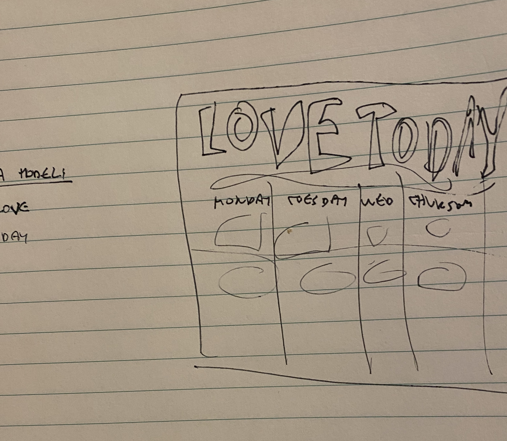
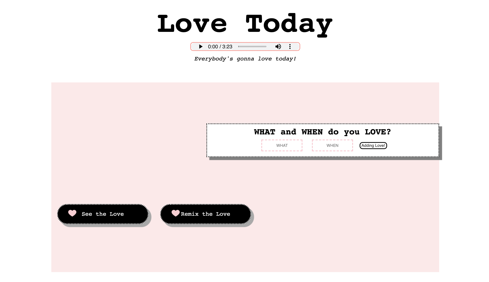
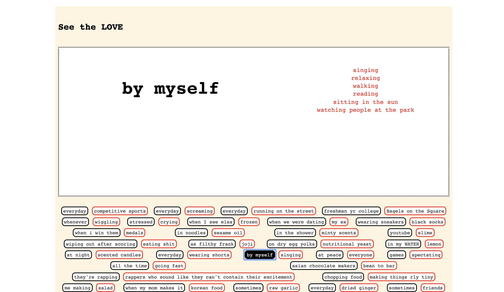
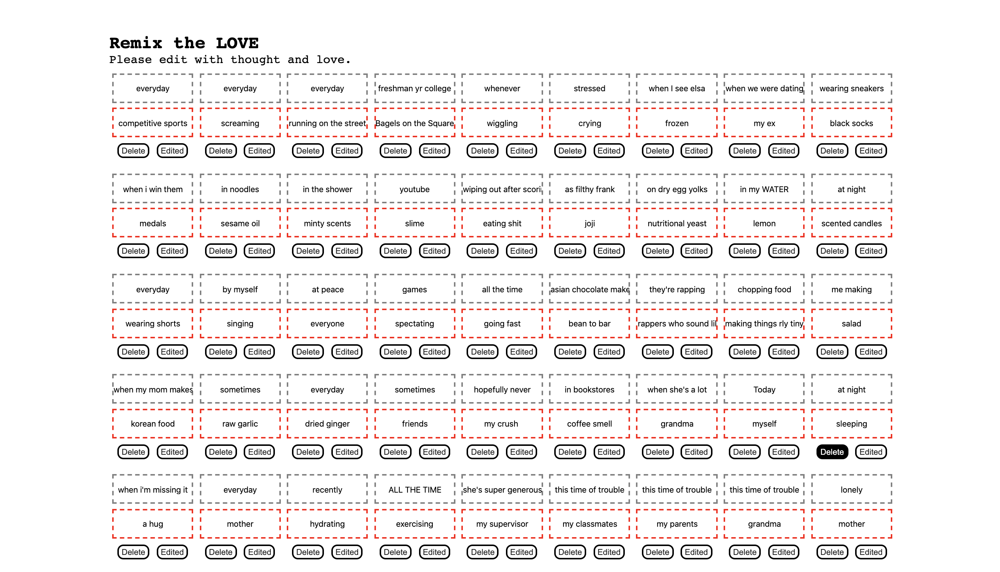

# Love Today: Dynamic Web Development Final

## Design and Interface

### Inspiration
This project is dedicated to all the little things I've loved and appreciated in my life! I decided to specifically hone in on love after listening to [Mika's song, Love Today](https://www.youtube.com/watch?v=AWiccrTB4LM). 

### Design Thoughts/Decisions
I thought it'd be nice if others could add what they love as well so the first thing that the visitor will see is an input form to describe what and when they loved something. I created a loose sketch below. 

Underneath the input form, they also have the options to view everything or edit what has been submitted. 

For the color scheme I knew I wanted to use romantic colors, such as pink, red, and white with black and grey. I also wanted to differentiate the presentation of the information from the rest of the page so it has a beige background. 

I also put in a lot of hover interactions to make things feel a little more alive!

Segments of this can be found in my assignment 5 as well! 

## Development 

### Setup
To start this project go to the project in the terminal and type "node index.js". To develop within the project type "nodemon index.js". [The site will start up here](http://localhost:3000/). 

[This will take you to the API](http://localhost:3000/api/v1/loves). 

### Code 
I was able to figure out the PUT and DELETE problems I was having in my assignment 5! I realized I was grabbing the wrong child element to be edited, and it ended up grabbing some other part of the page. 

I wanted to create a little display which would render based on the love item or time the visitor would choose. To filter and show the results, I also added two functions in my main.js file, handleSearch() and renderSee(). I ran into some difficulties because I wanted to filter my result by both "what" and "when" and have them both be displayed. 

I approached this by first having the results filtered by what button was pressed in handleSearch(). I also added a boolean that would indicate if the when/day button was pressed or not. I struggled a little here because I wanted the pressed button to act as a title and displayed only once (without it it would render as many times as the number of results). I wasn't sure what the best way to approach it was but it worked. 

The filtered result and boolean would then be passed to renderSee() and it would display a title (the chosen element) and the results adjacent to it. Before it renders the results I also had all child elements removed beforehand so the results won't stack on top of each other. 

In retrospect I also learned that plannings things out more specifically beforehand really helps with organization! The variable naming gets a little messy around the middle because I didn't plan it out well enough and decided to add new things halfway. I am not a huge planner but it may have helped if I revisited the drawing board more frequently while working through it. 

### References
Referenced from my Assignment 5 and the MongoDB Guide examples!

### End Result
Below is the final result. 

## Deployment

[Project on Heroku](https://love-today.herokuapp.com/)

## Next Steps
After adding some stuff and looking through it I personally felt a little soft thinking of everything I have loved! Maybe I'll continue to add to it or will look back at it as a nice reminder. OR MAYBE I will see some new mystery entries! 